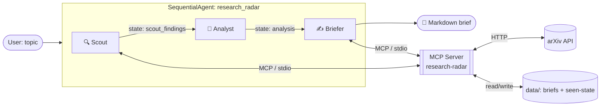

# 🔭 Research Radar

**Enter a research topic. Get back a cited, analyzed literature brief — and only the papers you haven't seen before.**

Research Radar is a multi-agent system built with [Google's Agent Development Kit (ADK)](https://google.github.io/adk-docs/). It scouts arXiv for the most relevant recent work on a topic, evaluates and ranks each paper, synthesizes a structured Markdown brief, and remembers what it already showed you so every re-run surfaces *new* literature.

> Built for the Kaggle **AI Agents: Intensive Vibe Coding Capstone** (Freestyle track).

---

## The problem

Keeping up with a research area is a chore. arXiv posts hundreds of papers a day; a keyword search returns a firehose sorted by date, full of loosely-matching noise. Researchers, students, and engineers waste hours triaging titles to find the few papers that actually matter — and the next week they do it again, re-reading the same results.

A plain "summarize arXiv" script doesn't solve this. It can't judge relevance, it can't track what you've already seen, and it dumps a wall of text instead of a usable brief.

## The solution

Research Radar treats literature review as a **pipeline of specialized agents**, each doing one job well:

| Agent | Role | Tools |
|-------|------|-------|
| **Scout** | Finds the most relevant papers for the topic and filters out anything already covered in past briefs | `search_arxiv`, `get_seen_paper_ids` (MCP) |
| **Analyst** | Scores each paper's relevance (1–5), extracts its key contribution, and identifies cross-cutting themes | *(pure reasoning)* |
| **Briefer** | Writes the polished Markdown brief and persists it, marking its papers as "seen" | `record_brief`, `list_past_briefs` (MCP) |

The agents never touch arXiv or the filesystem directly — they go through a **custom MCP (Model Context Protocol) server**, which is the project's single trusted tool boundary. Each agent is granted *only* the tools it needs (least privilege).

The result: re-run the same topic next week and Scout silently skips everything you've already read, so the brief is always "what's new for *you*."

---

## Architecture



Plain-text view:

```
user topic
    │
    ▼
┌─────────────────── SequentialAgent: research_radar ───────────────────┐
│  [Scout] ──state:scout_findings──▶ [Analyst] ──state:analysis──▶ [Briefer] │
│     ▲                                                                ▲   │
└─────┼────────────────────────────────────────────────────────────── ┼──┘
      │ MCP (stdio)                                          MCP (stdio)│
      ▼                                                                 ▼
            ┌─────────────── MCP Server (research-radar) ───────────────┐
            │  search_arxiv · get_seen_paper_ids · record_brief · ...    │
            └───────────┬───────────────────────────────┬──────────────┘
                        ▼                                ▼
                   arXiv API                    data/ (briefs + seen-state)
```

**Why this design**
- **Multi-agent over one mega-prompt:** separating gather / evaluate / synthesize keeps each agent's instructions focused and its output inspectable. State flows between stages via ADK `output_key`.
- **MCP server as the tool boundary:** the same server can be reused by any MCP-aware client, and scoping tools per agent (`tool_filter`) keeps the trust surface small.
- **Memory via the tool layer:** dedupe state lives behind `record_brief` / `get_seen_paper_ids`, so the "radar" behavior is a property of the tools, not buried in a prompt.

---

## Course concepts demonstrated

- ✅ **Agent / Multi-agent system (ADK)** — `SequentialAgent` orchestrating three `LlmAgent` specialists with state hand-off.
- ✅ **MCP Server** — a custom `FastMCP` server (`mcp_server/server.py`) exposing four tools over stdio, consumed by ADK via `MCPToolset`.
- ✅ **Security features** — secrets kept in `.env` (git-ignored, never in code); per-agent least-privilege tool scoping; input validation and caps in every MCP tool (max results, topic length, brief size); the agents cannot read arbitrary files — only the MCP tools' fixed `data/` paths.
- ➕ **Antigravity** — developed/iterated in Google's Antigravity IDE (shown in the demo video).

---

## Setup

**Requirements:** Python 3.10+ and a free [Gemini API key](https://aistudio.google.com/apikey).

```bash
# 1. Create and activate a virtual environment
python -m venv .venv
# Windows:
.venv\Scripts\activate
# macOS/Linux:
source .venv/bin/activate

# 2. Install dependencies
pip install -r requirements.txt

# 3. Add your API key
cp .env.example .env       # then edit .env and paste your key
```

Your `.env`:
```
GOOGLE_API_KEY=your_key_here
GOOGLE_GENAI_USE_VERTEXAI=FALSE
```

## Usage

**CLI (one-shot brief):**
```bash
python radar.py "retrieval augmented generation evaluation"
```
The brief prints to the console and is saved to `data/briefs/`. Run the same topic again later to get only newly-published / not-yet-seen papers.

**Interactive dev UI (ADK):**
```bash
adk web
```
Then open the printed URL, pick `research_radar`, and type a topic. The UI shows each agent and tool call in sequence — great for understanding the flow.

> **Model note:** the default model is `gemini-2.5-flash-lite` (fast, generous free tier). For the highest-quality brief, set `GEMINI_MODEL=gemini-2.5-flash` in `.env` (smaller free quota).

---

## Project structure

```
.
├── research_radar/          # ADK agent package
│   ├── agent.py             # root_agent: Scout → Analyst → Briefer + MCP wiring
│   ├── prompts.py           # per-agent instructions
│   └── __init__.py
├── mcp_server/
│   └── server.py            # FastMCP server: arXiv search + brief/seen store
├── radar.py                 # headless CLI runner
├── data/                    # generated briefs + dedupe state (git-ignored)
├── requirements.txt
└── .env.example
```

## Security notes

- **No secrets in code.** The API key is read from `.env`, which is git-ignored.
- **Least privilege.** Scout can search but not write; Briefer can write but not search — enforced with MCP `tool_filter`.
- **Bounded tools.** Every MCP tool clamps its inputs (result counts, topic length, stored-brief size) so a malformed agent request can't run away.
- **No arbitrary file/network access from agents.** All I/O is mediated by the MCP server's fixed tool set.

## Limitations & future work

- Source is arXiv only; adding more MCP tools (Semantic Scholar, conference proceedings, RSS) would broaden coverage.
- Relevance scoring is LLM-judged; a hybrid with embedding similarity would be more robust.
- A scheduled run (e.g., Cloud Run + Cloud Scheduler) would turn this into a true daily-digest service.
